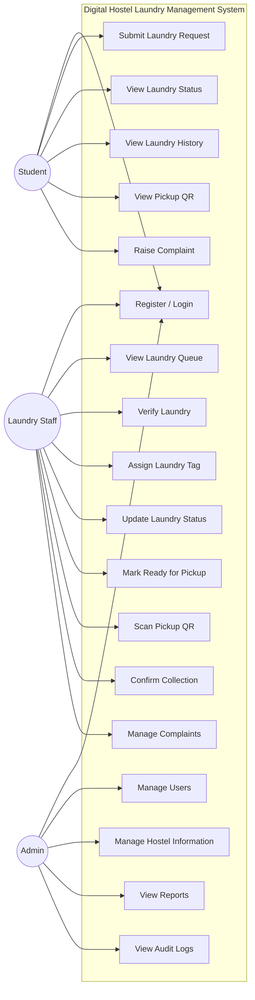
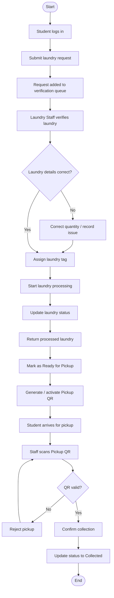
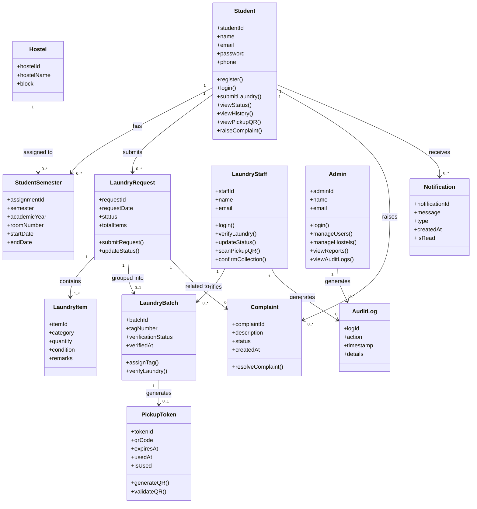
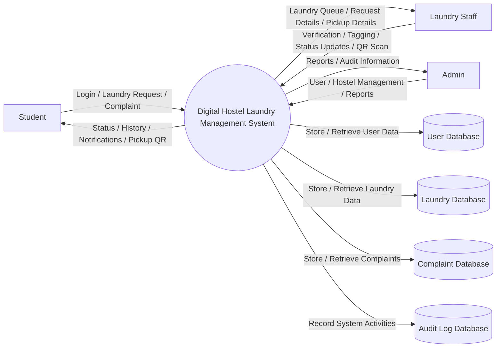
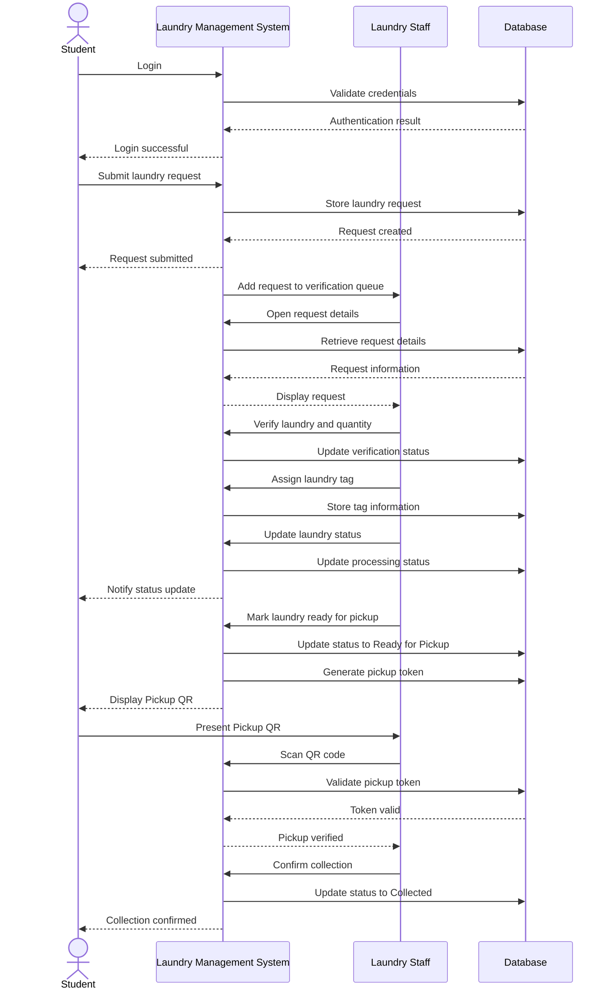

# System Design Diagrams

## 1. Use Case Diagram


```mermaid
flowchart LR

    Student((Student))
    Staff((Laundry Staff))
    Admin((Admin))

    subgraph System["Digital Hostel Laundry Management System"]

        UC1[Register / Login]
        UC2[Submit Laundry Request]
        UC3[View Laundry Status]
        UC4[View Laundry History]
        UC5[View Pickup QR]
        UC6[Raise Complaint]

        UC7[View Laundry Queue]
        UC8[Verify Laundry]
        UC9[Assign Laundry Tag]
        UC10[Update Laundry Status]
        UC11[Mark Ready for Pickup]
        UC12[Scan Pickup QR]
        UC13[Confirm Collection]
        UC14[Manage Complaints]

        UC15[Manage Users]
        UC16[Manage Hostel Information]
        UC17[View Reports]
        UC18[View Audit Logs]
    end

    Student --> UC1
    Student --> UC2
    Student --> UC3
    Student --> UC4
    Student --> UC5
    Student --> UC6

    Staff --> UC1
    Staff --> UC7
    Staff --> UC8
    Staff --> UC9
    Staff --> UC10
    Staff --> UC11
    Staff --> UC12
    Staff --> UC13
    Staff --> UC14

    Admin --> UC1
    Admin --> UC15
    Admin --> UC16
    Admin --> UC17
    Admin --> UC18

```

    ````markdown
## 2. Activity Diagram


```mermaid
flowchart TD

    A([Start]) --> B[Student logs in]
    B --> C[Submit laundry request]
    C --> D[Request added to verification queue]

    D --> E[Laundry Staff verifies laundry]
    E --> F{Laundry details correct?}

    F -- No --> G[Correct quantity / record issue]
    G --> H[Assign laundry tag]
    
    F -- Yes --> H[Assign laundry tag]

    H --> I[Start laundry processing]
    I --> J[Update laundry status]
    J --> K[Return processed laundry]

    K --> L[Mark as Ready for Pickup]
    L --> M[Generate / activate Pickup QR]

    M --> N[Student arrives for pickup]
    N --> O[Staff scans Pickup QR]
    O --> P{QR valid?}

    P -- No --> Q[Reject pickup]
    Q --> O

    P -- Yes --> R[Confirm collection]
    R --> S[Update status to Collected]
    S --> T([End])
```

## 3. Class Diagram


```mermaid
classDiagram

    class Student {
        +studentId
        +name
        +email
        +password
        +phone
        +register()
        +login()
        +submitLaundry()
        +viewStatus()
        +viewHistory()
        +viewPickupQR()
        +raiseComplaint()
    }

    class Hostel {
        +hostelId
        +hostelName
        +block
    }

    class StudentSemester {
        +assignmentId
        +semester
        +academicYear
        +roomNumber
        +startDate
        +endDate
    }

    class LaundryRequest {
        +requestId
        +requestDate
        +status
        +totalItems
        +submitRequest()
        +updateStatus()
    }

    class LaundryItem {
        +itemId
        +category
        +quantity
        +condition
        +remarks
    }

    class LaundryBatch {
        +batchId
        +tagNumber
        +verificationStatus
        +verifiedAt
        +assignTag()
        +verifyLaundry()
    }

    class LaundryStaff {
        +staffId
        +name
        +email
        +login()
        +verifyLaundry()
        +updateStatus()
        +scanPickupQR()
        +confirmCollection()
    }

    class PickupToken {
        +tokenId
        +qrCode
        +expiresAt
        +usedAt
        +isUsed
        +generateQR()
        +validateQR()
    }

    class Complaint {
        +complaintId
        +description
        +status
        +createdAt
        +resolveComplaint()
    }

    class Admin {
        +adminId
        +name
        +email
        +login()
        +manageUsers()
        +manageHostels()
        +viewReports()
        +viewAuditLogs()
    }

    class Notification {
        +notificationId
        +message
        +type
        +createdAt
        +isRead
    }

    class AuditLog {
        +logId
        +action
        +timestamp
        +details
    }

    Student "1" --> "0..*" StudentSemester : has
    Hostel "1" --> "0..*" StudentSemester : assigned to

    Student "1" --> "0..*" LaundryRequest : submits
    LaundryRequest "1" --> "1..*" LaundryItem : contains
    LaundryRequest "1" --> "0..1" LaundryBatch : grouped into

    LaundryStaff "1" --> "0..*" LaundryBatch : verifies
    LaundryBatch "1" --> "0..1" PickupToken : generates

    Student "1" --> "0..*" Complaint : raises
    LaundryRequest "1" --> "0..*" Complaint : related to

    Student "1" --> "0..*" Notification : receives

    Admin "1" --> "0..*" AuditLog : generates
    LaundryStaff "1" --> "0..*" AuditLog : generates
```

## 4. Data Flow Diagram (DFD)


```mermaid
flowchart LR

    Student[Student]
    Staff[Laundry Staff]
    Admin[Admin]

    System((Digital Hostel Laundry Management System))

    UserDB[(User Database)]
    LaundryDB[(Laundry Database)]
    ComplaintDB[(Complaint Database)]
    AuditDB[(Audit Log Database)]

    Student -->|Login / Laundry Request / Complaint| System
    System -->|Status / History / Notifications / Pickup QR| Student

    Staff -->|Verification / Tagging / Status Updates / QR Scan| System
    System -->|Laundry Queue / Request Details / Pickup Details| Staff

    Admin -->|User / Hostel Management / Reports| System
    System -->|Reports / Audit Information| Admin

    System -->|Store / Retrieve User Data| UserDB
    System -->|Store / Retrieve Laundry Data| LaundryDB
    System -->|Store / Retrieve Complaints| ComplaintDB
    System -->|Record System Activities| AuditDB
```

## 5. Sequence Diagram


```mermaid
sequenceDiagram

    actor Student
    participant App as Laundry Management System
    participant Staff as Laundry Staff
    participant DB as Database

    Student->>App: Login
    App->>DB: Validate credentials
    DB-->>App: Authentication result
    App-->>Student: Login successful

    Student->>App: Submit laundry request
    App->>DB: Store laundry request
    DB-->>App: Request created
    App-->>Student: Request submitted

    App->>Staff: Add request to verification queue
    Staff->>App: Open request details
    App->>DB: Retrieve request details
    DB-->>App: Request information
    App-->>Staff: Display request

    Staff->>App: Verify laundry and quantity
    App->>DB: Update verification status
    Staff->>App: Assign laundry tag
    App->>DB: Store tag information

    Staff->>App: Update laundry status
    App->>DB: Update processing status
    App-->>Student: Notify status update

    Staff->>App: Mark laundry ready for pickup
    App->>DB: Update status to Ready for Pickup
    App->>DB: Generate pickup token
    App-->>Student: Display Pickup QR

    Student->>Staff: Present Pickup QR
    Staff->>App: Scan QR code
    App->>DB: Validate pickup token
    DB-->>App: Token valid
    App-->>Staff: Pickup verified

    Staff->>App: Confirm collection
    App->>DB: Update status to Collected
    App-->>Student: Collection confirmed
```